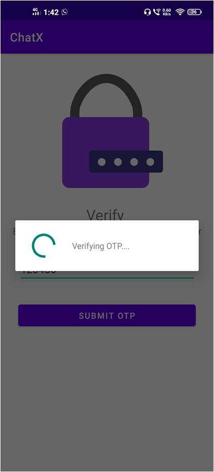
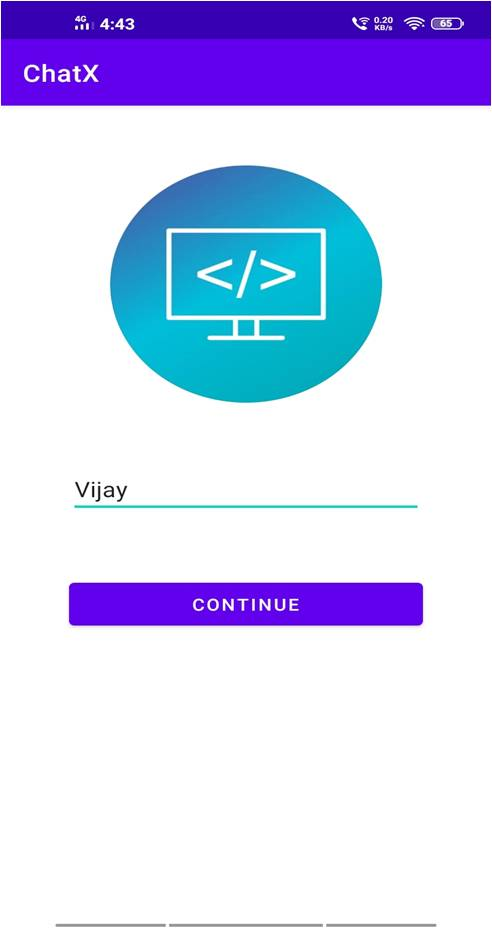

# ChatX - chatting app

This is a simple chatting application which helps users to  chat with other users without the need of saving their number. This app uses firebase phone authentication, realtime database, firebase storage.

## Tech Stack

**Client:** Android studio, glide library, etc.

**Server:** Firebase phone authentication, realtime database, Firebase storage.

## Screenshots

     
     
     
